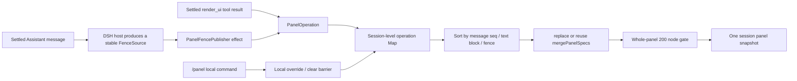

# DSH GenUI Stability, Performance, and Release Hardening Execution Plan

> Status: actionable
> Audit baseline: plugin repo `1aade42fd73c087b3f3bd7284da5c470285f0c6e` (`0.3.4`); execution must still re-fetch the latest remote
> Executor: DSH
> Plan dates: 2026-08-11 through 2026-08-12
> Target version: `0.4.0` candidate; do not merge, tag, or publish without explicit authorization

## 1. Conclusion

This is not another round of "keep adding components" but a round of closing things out. Once execution completes, the plugin should rise from "many features but unstable boundaries" to "panel ordering is reliable, forms do not share state, Chinese input does not submit by mistake, malicious/truncated input cannot hang the page, and installation and release can be verified repeatedly."

The following order must be advanced serially:

1. First, complete the fence's stable source identity and true ordering in the DSH main repo.
2. Then redo the panel publishing model in the plugin repo, fixing append loss, replay duplication, `Infinity` deadlock, and unbounded growth at the root.
3. Then fix forms, persistence, Chinese input, and password collection boundaries.
4. Then address the parser, idle 3D, and pointer listener performance.
5. Finally align the build, bundle size, installer, E2E, CI, documentation, and release facts.

No stage may bypass the root cause using random IDs, content hashes, timestamps, compatibility layers, or "ignore failures for now."

## 2. Verified Baseline

| Item | Current fact | User impact |
|---|---|---|
| Local tests | 24 test files, 208 tests pass | Existing tests are all green, but they do not cover the cross conditions in this plan |
| Types and build | TypeScript and tsdown both complete | tsdown has 3 deprecated config warnings |
| Browser bundle | `lib/client.js` about 9.02 MB, gzip about 1.72 MB | Mermaid and Three are folded into the single browser bundle; "lazy load" does not mean lazy download |
| npm package | Most recent dry-run: 114 files, 4.82 MB packed, 25.16 MB unpacked | Brings in 15.16 MB of sourcemaps, source, intermediate JS, maps, and build cache |
| Workspace | At 2026-08-12 00:14 external changes were observed: local main is 1 generated-artifact commit `692a2b7` ahead of `origin/main`, plus uncommitted `scripts/e2e.mjs` onboarding changes | Neither came from this plan document; implementation must preserve the scene, use an independent worktree, and must not reset, overwrite, or pass these off as changes from this plan |
| Panel append | The plugin treats each Markdown document's local `key` as a session-level source ID | When both messages append at block 0, the second is treated as a duplicate and lost |
| Panel replay | Each session records only "the last append source" | A→B→A appends A again |
| Panel ordering | Fences publish with `Infinity` by default | After one fence publish, all future `render_ui` results with finite sequence numbers can no longer update the panel |
| Panel limit | Each input is first repaired to 200 nodes, but after merging there is no total cap | Repeated appends across rounds can grow without bound and slow the page |
| Forms | tabs creation misses passing block-level answer state | Inside a tab, grouped radio, field collection, submit, and local grading are broken |
| State | Panel content fingerprint changes but `GenuiBlock` does not remount | Old answers, old fields, and locked state are written into the persistence key of the new content |
| Chinese input | Enter/Cmd+Enter does not fully protect the IME composition state | The Enter that picks a Chinese candidate may be treated as a submit |
| Sensitive information | password input is supported, and every field with an id goes to localStorage in plaintext | Model-generated UI can collect and persist passwords |
| partial parsing | Rescans the prefix for every `}` and calls `JSON.parse` repeatedly | A 24 KB pathological input measured about 1.68 seconds; complexity is O(n²) |
| 3D | A static scene runs requestAnimationFrame forever | Still consumes GPU/battery while idle |
| Install script | Directly `cp` over symlinks with a different target | May overwrite the user file the link points to |
| E2E | Declares a log path, but child process output is discarded; a local text change after a click can satisfy the "responded" check | No logs on failure, and possible false passes |
| Minimum DSH version | README says `47d230e`, but the current `dsh.client` manifest requires at least `0545fdcb` | Users following the docs may still fail to load; once this plan's host contract lands the minimum version moves up again |
| Remote CI | The last three runs were blocked by GitHub Billing before runner allocation | No gate has actually executed remotely, so CI cannot be considered passing |

## 3. Definition of Done

Only when all of the following hold can this round be called complete:

- Two different messages each append once even when their local fence key is both `0`.
- A→B→A, StrictMode, refresh, virtual list remount, and out-of-order replay neither duplicate nor lose.
- A later `render_ui` can override an earlier panel fence; `Infinity` no longer exists.
- The entire merged panel never exceeds 200 nodes.
- Forms inside tabs, at the root level, and inside accordion behave identically.
- New content does not inherit or pollute the old content's answers, fields, and locked state; identical content can still restore its own state.
- Chinese IME candidate selection does not trigger input Enter or textarea Cmd/Ctrl+Enter submit.
- `password` is no longer part of the public spec, and is not repaired into a normal text box that keeps displaying; the model prompt and the Skill explicitly forbid requesting secrets.
- A 24 KB pathological partial input has a definite upper bound on `JSON.parse` attempts, and the page no longer stalls for seconds.
- A static 3D scene has no permanent animation frame; dragging and wheel still redraw normally.
- The install script fails safely on a different target or a dangling symlink, and the external sentinel file stays unchanged.
- The `lib/client.js` SHA is identical across 5 consecutive builds.
- The published package does not contain `src/`, `.map`, `.tsbuildinfo`, or `lib/types/**/*.js`; packed <3 MB, unpacked <10 MB.
- E2E passes only when a "genuine new assistant reply/new panel result" appears; failure logs are readable and no processes are left behind.
- Release evidence finally pins one compatibility tuple: `plugin release SHA + minimum DSH host SHA`; the plugin package, changelog, tag, Release, and installation verification point to the plugin SHA, while README/compatibility matrix pins the host SHA separately.
- GitHub Actions obtains a real runner and runs to completion; `steps: []` does not count as CI.

## 4. Scope and Explicit Non-Goals

### Included in this round

- The fence source contract in the DSH main repo.
- The plugin client's panel, forms, persistence, IME, parser, 3D, and drag paths.
- Plugin build, dependencies, published package, install script, E2E, CI, README, Skill, system prompt, and changelog.
- Minimal regression tests covering the root causes plus real isolated-environment acceptance.

### Not in this round

- No new state management library, ID library, parser library, 3D controller library, or virtual list library.
- No model patch/diff protocol, no new compatibility layer.
- Do not use `Date.now()`, random numbers, `useId()`, or content hashes in place of message identity.
- Do not split Mermaid/Three via CDN, and do not hand-write another "lightweight 3D".
- Do not touch the running 3080 service, do not broad `pkill`, and do not take over the user's current browser window.
- This round keeps the `scene3d` product capability by default and only fixes the permanent 60fps; whether to delete it goes through a separate decision gate.
- Without explicit authorization from Changfenhuang, do not merge, do not tag, do not publish, and do not restart the DSH service the user is using.

## 5. Target Data Flow



Core principle: the panel is "a result folded from stable events", not "whoever triggered the React render last wins".

## 6. Serial Delivery Structure

| Stage | Repo | Deliverable | Depends on | Release blocking |
|---|---|---|---|---|
| 0 | Both | Clean baseline and evidence | None | Yes |
| 1 | DSH main repo | Stable fence source identity and ordering | 0 | Yes |
| 2 | Plugin repo | Panel operation table, true ordering, total cap | 1 | Yes |
| 3 | Plugin repo | Forms, state, IME, password boundaries | 2 | Yes |
| 4 | Plugin repo | partial, 3D, pointer performance | 3 | Yes |
| 5 | Plugin repo | Deterministic build, bundle size, dependencies, install safety | 4 | Yes |
| 6 | Both/CI | E2E, documentation, compatibility matrix, release candidate | 5 + Billing restored | Yes |

A stage may contain multiple atomic commits, but the same core file must not be modified in parallel across stages.

---

## Stage 0: Establish an Execution Baseline That Does Not Pollute the User's Scene

### 0.1 Use an Independent worktree

1. Run `git fetch --prune origin` in the plugin repo.
2. Record the full SHA of `origin/main`.
3. Create an independent `codex/`-prefixed branch and temporary worktree from the latest `origin/main`; first record the local main workspace's `692a2b7` and the `scripts/e2e.mjs` WIP separately, do not auto cherry-pick and do not delete.
4. Create an independent worktree for the DSH main repo from the latest remote as well.
5. Preserve all local commits/WIP in the current main workspace; `git reset --hard`, `git checkout --`, or cleaning these files is forbidden. Whether to absorb the generated-artifact commit is judged in 5.1 from source and SHA evidence once the deterministic build is done; the E2E onboarding WIP is decided in 6.1, without directly overwriting.

### 0.2 Record the baseline

In the plugin repo, record at least:

```sh
git status --short --branch
git rev-parse HEAD
corepack pnpm exec vitest run
corepack pnpm exec tsc -b --pretty false
corepack pnpm exec tsdown
wc -c lib/client.js
gzip -c lib/client.js | wc -c
npm pack --dry-run --json
```

In the DSH main repo, record at least:

```sh
git status --short --branch
git rev-parse HEAD
corepack pnpm exec vitest run packages/client/ui-primitives packages/client/ui-conversation
corepack pnpm run typecheck
```

### 0.3 Failure handling

- If the baseline fails due to existing code, first record the original error and do not attribute it to this plan.
- Dependency or network failures must be clearly distinguished; skipping tests and then claiming completion is forbidden.
- If the current remote has already changed, take the actual latest SHA as authoritative and re-verify the call chains referenced by this plan.

---

## Stage 1: Provide a Stable Fence Source Contract in the DSH Main Repo

### 1.1 Change goal

Currently `FenceRenderer` only receives `raw + React key`. The React key is only valid within one Markdown document and cannot carry session-level business identity.

In the DSH main repo's fence registry module, add:

```ts
export interface FenceSource {
  id: string
  order: readonly [messageSeq: number, textBlockIndex: number, fenceIndex: number]
}

export interface FenceRenderContext {
  /** Owning conversation route; absent outside a session-scoped chat render. */
  sessionId?: string
  source?: FenceSource
}

export type FenceRenderer = (
  raw: string,
  reactKey: Key,
  context: FenceRenderContext,
) => ReactNode
```

Do not keep a compatible two-argument call; switch the main repo and its only consumer in one go.

### 1.2 Identity rules

- A session-scoped Assistant render must explicitly provide `context.sessionId`; it is only responsible for routing and must no longer infer from the global active session.
- Provide `source` only when a settled or interrupted Assistant already has a stable `finalNode.seq`.
- During streaming, keep rendering ordinary inline GenUI: `sessionId` is available but `source` is empty, and the plugin must not write the panel or durable state.
- `source.id` uses a stable structure, for example:

```ts
JSON.stringify(['assistant', finalMessageSeq, textBlockIndex, fenceIndex])
```

- `source.order` is `[finalMessageSeq, textBlockIndex, fenceIndex]`.
- The session ID is the first-level key of the plugin panel store; pass it separately through context and do not stuff it into `source.id` again.
- `fenceIndex` must come from the stable fence order in the settled document, and must not use random numbers, mount counts, or time.

### 1.3 Files involved

DSH main repo:

- Fence registry interface: `packages/client/ui-primitives/src/markdown/fence-registry.ts`
- Markdown render call: `packages/client/ui-primitives/src/markdown/render.tsx`
- Markdown component entry: `packages/client/ui-primitives/src/markdown/MarkdownText.tsx`
- Assistant block bridge: `packages/client/ui-conversation/src/client/chat/AssistantMarkdown.tsx`
- Assistant node entry: `packages/client/ui-conversation/src/client/chat/AssistantNodeView.tsx`
- Corresponding ui-primitives / ui-conversation tests.

### 1.4 Implementation steps

1. `AssistantNodeView` reads the real `sessionId` from session-scoped standard props and always passes it down; it passes the stable message seq only when `data.finalNode` exists.
2. `AssistantMarkdown` keeps passing the real sessionId through, and adds `textBlockIndex` while iterating text blocks.
3. `MarkdownText` carries the sessionId and message prefix into the render context; other Markdown usages without these props keep rendering normally, but have no session routing or business source.
4. `renderCode` produces a `FenceSource` for each `dsh-ui` fence and calls the three-argument renderer.
5. Update the registry interface JSDoc: the React key is only responsible for reconciliation, while `source` is responsible for durable business identity.
6. Update the types of all test renderers and the single plugin consumer.

### 1.5 Host tests that must be added

| Case | Assertion |
|---|---|
| Both settled messages have only fence 0 | The two `source.id` differ |
| One message has two text blocks, each with a fence | The text block dimension differs |
| One text block has two fences | The fence dimension differs and order keeps document order |
| Re-render the same settled message | ID and order are exactly identical |
| Two sessions interleave rendering the same seq/block/fence position | source may be identical, but context.sessionId is correct for each, and publishing never crosses sessions |
| streaming → settled | streaming source is empty; only settled produces one stable source |
| Replay of an interrupted message | source is stable |
| Ordinary MarkdownText usage | No source, does not crash, still renders code blocks/inline UI |

### 1.6 Stage acceptance

```sh
corepack pnpm exec vitest run packages/client/ui-primitives packages/client/ui-conversation
corepack pnpm run typecheck
corepack pnpm run lint
```

After completion, record the full host commit SHA. The plugin's final README minimum DSH version must point to "the version containing this SHA", and must not keep writing `47d230e` or use "commit >= SHA".

### 1.7 Forbidden approaches

- Do not use `String(key)`.
- Do not use a raw content hash; identical content in different messages is still two independent appends.
- Do not use `useId()`, a module-level auto-increment counter, random numbers, or `Date.now()`.
- Do not call `getActiveSessionId()` to guess the session for a fence; when the host context lacks a sessionId, degrade to not persisting and not publishing the panel.
- Do not introduce a generation/retry state machine just to preserve streaming panel writes; the panel commits only after settled.

---

## Stage 2: Redo the Plugin Panel Publishing Model

### 2.1 The new session operation model

Delete the "current spec + `lastAppendSource` + `Infinity`" model and replace it with stable source operations:

```ts
type PanelOrder = readonly [number, number, number]

interface PanelOperation {
  sourceId: string
  order: PanelOrder
  mode: 'replace' | 'append'
  spec: GenuiSpec
}
```

Each session stores:

- `Map<sourceId, PanelOperation>`: durable message/tool operations.
- At most one append overflow barrier: keep the first complete `PanelOperation` rejected because the node count or operation count exceeded the limit, so that a deterministic re-fold can be redone when an earlier out-of-order replace arrives.
- Local `/panel` override: the default panel or clear, plus the maximum message seq it masked.
- The currently folded read-only snapshot.

### 2.2 Fence publishing must not happen inside the render function

In the plugin fence entry:

1. Ordinary inline specs keep returning UI.
2. When `panel:true` and either the host `context.sessionId` or `source` is missing, return `null` and do not write the store.
3. When both exist, return a keyed publisher component and pass the real sessionId from context as an explicit prop; do not read the global active session again when the effect runs.
4. The publisher submits a `PanelOperation` to that session inside `useEffect` and returns `null` itself.
5. StrictMode duplicate effects are deduplicated by source in the operation Map and must not notify twice.

This both eliminates the render side effect and ensures streaming does not first write with a temporary identity and then write again when settled.

### 2.3 Tool publishing rules

A settled `render_ui` result uses:

```ts
sourceId = JSON.stringify(['render_ui', block.callId])
order = [block.seq, -1, 0]
mode = 'replace'
```

Tools and fences go through the same operation pipeline; delete the other set of default ordering rules.

### 2.4 Fold algorithm

On each first receipt of a new source, perform one transactional candidate fold:

1. If the source is earlier than or equal to the current local clear/override barrier, reject the old replay.
2. If the `sourceId` is already in the operation Map or is exactly the overflow barrier's source, return directly without notifying or repeating diagnostics.
3. When an overflow barrier exists, new and old appends ordered no later than the barrier may still enter candidate recomputation; later appends are rejected outright. Any replace enters the candidate and the "latest replace" rule decides whether it is effective; this way a replace that arrives out of order but precedes the barrier correctly reopens subsequent appends.
4. Do not modify the official Map first; add the existing overflow operation and the new operation to a temporary copy, sort ascending by the three-part `order`, start the candidate fold from the latest effective replace, and cut off earlier operations.
5. `replace` replaces directly; `append` reuses the existing pure function `mergePanelSpecs`. A spec accepted for append must have at least one valid node.
6. After each append merge, reuse the existing whole-tree node count from `validateGenuiSpec`; when the candidate result exceeds 200 nodes, record this entry as the first overflow barrier, skip it and all appends ordered later, and keep the previously valid snapshot. Do not write a second node traversal and do not hand 201 nodes to React.
7. After the same latest replace, keep at most 200 append operations, directly reusing the 200 from `GENUI_LIMITS.maxNodes`, without adding another config item; even if the 201st does not grow the node count, the same overflow barrier rule requires the next one to use replace. This is the explicit memory bound of the operation Map.
8. Commit in one go only after the candidate snapshot, the trimmed Map, and the overflow barrier are all computed successfully; any validation exception keeps the old official state. Notify once only when the snapshot actually changes.
9. After a later replace succeeds, delete earlier operations and the old overflow barrier; on session destruction clear the Map, barrier, snapshot, and subscribers.

So each session keeps at most "the latest replace + 200 appends + 1 overflow marker". Once the node or operation limit is reached, the system prompt, Skill, and diagnostics all require the model to send a replace; do not introduce an LRU and do not guess eviction by arrival order.

### 2.5 The `/panel` local command

Delete the trick of disguising a durable message through `publishPanelSpec(sessionId, null/default)`, and provide explicit local interfaces:

- `setLocalPanel(sessionId, DEFAULT_PANEL_SPEC)`: immediately show and expand the default panel, and record the current maximum seen message seq as the barrier.
- `clearLocalPanel(sessionId)`: immediately clear, also recording the current maximum seen message seq as the barrier.
- The next later real tool/fence operation may cross the barrier; old history replay cannot resurrect the panel.
- When folding, first take the local override as the base, then process real operations after the barrier: a new replace replaces it, a new append merges into it; the base for clear is `null`.

Do not fake `Infinity`, `MAX_SAFE_INTEGER` messages, or random sources.

### 2.6 Fix inline state identity at the same time

The current inline durable key also uses the local fence key, so two messages with the same position and content share state. Change to:

- streaming: `stateKey` is `undefined`, do not write localStorage.
- settled: build `fenceStateKey` from the host `context.sessionId + source.id`; do not read the global active session.
- The React key of the top-level `ErrorBoundary` uses `source.id ?? reactKey`; this also fixes the React "top-level array element missing key" warning and atomically remounts on streaming→settled.
- Delete the invalid duplicate key on the inner `GenuiBlock`.

### 2.7 Panel content state remount

Compute this only once in the panel component:

```ts
const stateKey = panelStateKey(sessionId, JSON.stringify(spec))
```

Use `stateKey` as both the React key of the panel `ErrorBoundary` and `GenuiBlock.stateKey`. When the content fingerprint changes, the whole interactive tree is rebuilt atomically; do not clear step by step with `useEffect([stateKey])`.

### 2.8 Files involved

Plugin repo:

- Fence entry: `src/client/index.tsx`
- Panel store: `src/client/panel-store.ts`
- Tool card entry: `src/client/toolview.tsx`
- Local panel command: `src/client/panel-command.ts`
- Panel component: `src/client/panel.tsx`
- Interaction key: `src/client/interaction-store.ts`
- Panel, append, persistence, and fence tests.

### 2.9 Tests that must be added/replaced

| Case | Assertion |
|---|---|
| Both messages' local key is 0 | Both appends are kept |
| Two sessions interleave replaying the same source/order | Each only updates its own session's panel and durable state |
| Two messages with exactly the same content | Still each appends once |
| The same source repeated 3 times | Append and notify only once |
| A→B→A arrival | A and B once each |
| B arrives first, A later | Still finally folded as A→B |
| Replay append 10 after replace 20 | The old append does not affect the result |
| fence 20 then tool 30 | tool wins |
| Replay fence 20 after tool 30 | tool still wins |
| Two fences in the same message | Determined by text/fence order, not by effect order |
| Replay old A after clear | The panel is not resurrected |
| Replay old A after setting the default panel | Only the default panel is kept; old A is not re-merged |
| New C after clear | C builds the panel normally |
| Total nodes would reach 201 after append | This append is rejected, DOM ≤200 |
| The same over-limit source replayed 3 times | Map/snapshot unchanged, only one diagnostic produced |
| A later append arrives after the limit | Idempotently rejected by the overflow barrier, Map not grown |
| A later replace arrives after the limit | replace takes effect and clears the old barrier, after which appends can resume |
| The 201st append after 200 same-label tab updates | Rejected even though the node count did not grow; the Map keeps a fixed upper bound |
| StrictMode publisher | snapshot and notification each happen only once |
| The same inline spec in two messages | The two durable states are independent of each other |
| Replace panel A with B in place after A was answered | B has no old answers, fields, or locked, and A is not written into B's key |
| Text + two valid fences | No React unique key warning; both render |

Delete the existing "fence = Infinity always wins" test and replace it with true ordering tests; do not keep incorrect expectations.

### 2.10 Stage acceptance

```sh
corepack pnpm exec vitest run tests/genui-panel.spec.tsx tests/panel-append.spec.tsx tests/genui-v27.spec.tsx tests/genui-error-boundary.spec.tsx
corepack pnpm exec vitest run
corepack pnpm exec tsc -b --pretty false
```

Verify again in a real isolated session: two consecutive rounds each output a `panel:true, append:true` fence, and both fences are the first Markdown block in their respective messages; the panel must keep the content of both rounds.

### 2.11 Forbidden approaches

- Do not simply swap `lastAppendSource` for a bounded LRU or Set and keep merging by arrival order.
- Do not deduplicate with a raw hash.
- Do not keep "last caller wins" in another form using `Infinity`, `MAX_SAFE_INTEGER`, or timestamps.
- Do not write to an external store directly inside the renderer pure function.
- Do not introduce a virtual list for unbounded appends; this round enforces the whole-panel 200 node cap directly.

---

## Stage 3: Forms, State, IME, and Sensitive Information Boundaries

This stage concentrates on modifying `GenuiBlock.tsx` to avoid repeated conflicts across many branches.

### 3.1 tabs pass through block-level answer state

In the tabs branch of `renderNode`, add `answers={answers}`. Do not create a new store or Context inside `TabsNode`.

Tests must include:

- grouped radio + input(id) + submit inside a tab.
- Local grading, locking, and re-answering inside a tab.
- Switching tabs and returning keeps the block-level answers.
- The payload contains both the correct `answers` and `fields`.

### 3.2 Simplify answer state

Delete the unread `AnswerEntry.label`:

- In-memory answers become `Record<string, string>`.
- `setAnswer(group, choice)` compares strings only.
- Question display keeps reading `QuestionMeta.label` uniquely.
- The localStorage structure is already a string table, so no migration and no compatibility layer.
- The submit payload no longer does a second conversion from `{label, choice}` to a string.
- Add the existing `round` to the Radio React key and delete the sync effect that watches round and then `setSelected`.

Acceptance: v2.5/v2.6/v2.7 answering, grading, wrong answers, retry, refresh restore, and action payload behavior are unchanged, with a net reduction in code.

### 3.3 Establish field invariants

- When `value.trim() === ''`, delete that id from the shared `fields`.
- When non-empty, keep the user's original string; do not trim the payload on your own.
- On first mount, Input/Textarea register a non-empty `node.value` into the shared fields.
- Submit uses the same `filledFields` when computing `answered`, ready, and the payload; defensively filter blank values.
- Do not unilaterally change "any non-empty field makes it submittable" into "all fields are required".

Tests: clear after typing re-disables, whitespace-only disables, one empty and one non-empty sends only one, default values are initially submittable, original whitespace in non-empty values is preserved.

### 3.4 Reuse DSH's already-verified complete IME protection

Both Input Enter and Textarea Ctrl/Cmd+Enter must use the DSH main input box's three-layer check:

1. `compositionstart` sets the composing ref.
2. `compositionend` clears the ref after a 10ms delay, covering the Safari closing keydown order.
3. keydown checks the ref, `nativeEvent.isComposing`, and `nativeEvent.keyCode === 229` at the same time.

Tests:

- `isComposing:true` does not submit.
- `keyCode:229` does not submit.
- compositionStart→compositionEnd→immediately followed by Enter does not submit.
- A normal Enter after the delay does submit, only once.
- Textarea Ctrl+Enter and Cmd+Enter cover the same path.

Real acceptance must complete "type candidates → Enter to pick → Enter again to submit" using Chinese pinyin on an isolated DSH page; the first Enter produces no model message.

### 3.5 Delete the password capability

This is a security boundary; no compatibility is kept:

- `GenuiInput.inputType` keeps only `text | email`.
- When the guard encounters a known input node with `inputType === 'password'`, drop the whole node; do not silently remove the attribute and render it as a visible text box.
- The validator gives a diagnosable error.
- The system prompt, `SKILL.md`, README, and examples drop password.
- Add an explicit rule: GenUI must not request passwords, API Keys, access tokens, recovery codes, or other secrets.
- Test that a malicious password spec produces no input DOM and writes no value to localStorage.

### 3.6 Honest click feedback

Change the button's local chip from "responded" to "triggered" or "clicked". The former only proves the local event fired and cannot imply the model received or responded.

This round does not extend the whole `GenuiActionHandler` to a Promise; async success/failure state comes after the host provides a unified send-failure feedback channel. The existing catch must at least log errors that do not contain action payload/secret values plus session location information, and must not swallow them silently.

### 3.7 Stage tests and acceptance

```sh
corepack pnpm exec vitest run tests/genui-v25.spec.tsx tests/genui-v26.spec.tsx tests/genui-v27.spec.tsx tests/genui-hardening.spec.tsx
corepack pnpm exec vitest run
corepack pnpm exec tsc -b --pretty false
```

Completion criteria: forms in tabs, root level, and accordion have identical semantics; IME does not mis-send; empty fields do not count as complete; password has no rendering, no persistence, and no instructional text.

---

## Stage 4: Parsing, 3D, and Pointer Performance

### 4.1 Turn partial parsing from unbounded attempts into bounded linear work

Keep the existing complete-JSON fast path and do not introduce a parser dependency; change the current "rescan the prefix on every `}`" into a genuinely single forward scan.

Implementation:

1. Reuse `GENUI_LIMITS.maxDepth` and define a total repair candidate/attempt cap `MAX_PARTIAL_REPAIR_ATTEMPTS = 32`, without adding a second set of depth numbers.
2. Do a full `JSON.parse` at most once.
3. Use a small pure candidate collector to read the original text once from left to right: keep correctly skipping strings/escapes and maintain a bracket stack; when a valid object closes and the stack depth is within the existing 8-level limit, directly record `{ end, closingSuffix }`, with a fixed ring buffer keeping only the 32 candidates needed in the longest direction.
4. balanced prefixes and unfinished candidates are merged and deduplicated in this scan; after the scan, `JSON.parse` starting from the longest candidate. Calling `scanBrackets(text.slice(...))` inside the `}` loop is forbidden, as is a second bracket scan of any prefix.
5. After 32 attempts, return `null` and wait for more streaming content or the settled fallback.
6. Add a `ponytail:` comment explaining: a single scan + 32 parses is the protective cap at the current depth 8 and 200 nodes; only switch to a tokenizing parser when real streaming samples prove the recovery rate is insufficient.
7. Do not add an arbitrary raw byte cap below the existing valid spec capability.

Tests:

- Keep all existing partial prefix recovery cases.
- Construct the audit's pathological input of about 24 KB with 8000 closed objects.
- In tests the candidate collector returns/exposes a `scannedChars` diagnostic value (not exported from the package entry), asserting it equals the input length and the candidate count ≤32; in the source the parser may call the collector only once.
- spy `JSON.parse` and assert total calls do not exceed 33 (one full + 32 repairs).
- Record the P95 of 20 benchmarks on the same machine; the target is <50ms, but the timing value serves only as local evidence and is not used as a flaky CI assertion.

### 4.2 Pass the scene3d deletion decision gate first

Make the product decision first, then write 3D optimization, so a refactor is not immediately followed by deletion.

This round does not delete by default. Reason: it is a publicly shipped, demonstrated product capability; switch to the deletion path only when both of the following hold:

1. Real sessions prove `scene3d` usage is 0 since release, and the statistics must exclude gallery/demo/test.
2. The product explicitly confirms deletion.

If deletion is confirmed, delete the following in an independent commit and skip all scene3d-specific changes in 4.3 and 4.4:

- 3D renderer, component branch, spec, guard, CSS, gallery, default panel statistics, system prompt, Skill, README, demo, and tests.
- `three`, `@types/three`, and the lockfile.
- Do not keep an old-spec compatibility layer.

Deletion acceptance: `rg scene3d` is allowed only in the historical changelog; client.js is expected to shrink by at least about 1.8 MB. Without evidence or confirmation, record "keep" and proceed to 4.3.

### 4.3 When keeping it, change static 3D to event-driven rendering

- Delete the permanent `requestAnimationFrame` loop and `cancelAnimationFrame`.
- Render once after scene initialization completes.
- Render once immediately after orbit updates the camera.
- pointer move (while dragging) and wheel trigger orbit/render.
- 0 continuous animation frames while idle.
- Keep correct dispose of mesh, geometry, material, and renderer.

Tests/acceptance:

- After simulated initialization, the renderer renders only once.
- Idling for one second does not increase the render count.
- One drag move and one wheel each add one render.
- Dragging and zooming still work in real headless Chrome; a Performance recording of a static scene shows no continuous RAF.

### 4.4 Use Pointer Capture to delete global listeners

Panel dragging reuses the native pattern of the in-repo function graph:

- pointerdown on the handle calls `setPointerCapture(pointerId)`.
- move/up/cancel are all bound to the handle.
- Delete the window pointermove/pointerup registration, deregistration, and cleanup effect.
- Keep the 120–600px clamping, collapsed height memory, and accessible separator.

Only when 4.2 chooses to keep scene3d, move the 3D canvas dragging to canvas pointer capture and delete scene3d's window pointer listener; if deletion is chosen, do not write this code that would be immediately deleted.

Tests: dragging the panel beyond the element bounds stays continuous, pointercancel clears active, releasing no longer changes anything, unmount leaves no residue; run the same cases on the canvas when 3D is kept. The corresponding source must no longer contain a window pointer listener.

### 4.5 Stage gate

```sh
corepack pnpm exec vitest run tests/genui-partial.spec.tsx tests/genui-panel.spec.tsx tests/genui-v12.spec.tsx
corepack pnpm exec vitest run
corepack pnpm exec tsc -b --pretty false
```

---

## Stage 5: Deterministic Build, Smaller Install Package, Hardened Installer

### 5.1 First pin the CSS export order on its own

Before constructing the CSS Modules classMap, sort by local class name with a fixed UTF-16 sort:

- Do not use `localeCompare`, avoiding system locale differences.
- Do not change hash class names or values; only pin the object key order.
- Do not add test-only production exports.

Acceptance: 5 consecutive builds in the same clean worktree give completely identical `shasum -a 256 lib/client.js`; artifacts committed on macOS rebuild with no diff on Ubuntu CI.

### 5.2 Build tsdown directly from src and have tsc emit declarations only

This group must be one atomic commit:

1. `tsconfig.json` adds `emitDeclarationOnly: true`.
2. Turn off `declarationMap` and delete the meaningless `sourceMap`.
3. A single package has no project reference: change the script to `tsc -p tsconfig.json`, delete `composite` and `incremental`, and stop generating `tsconfig.tsbuildinfo`.
4. Change the tsdown client entry to `src/client/index.tsx`.
5. Change the Node entries to `src/plugin/index.ts` and `src/plugin/invariant.ts`.
6. Resolve CSS directly through the source importer, deleting `sourceAssetPath`, `existsSync`, `sep`, and the `lib/types` backtracking logic.
7. Turn off sourcemaps for the production browser bundle and delete sourceMappingURL and the sourcemap path conversion code.
8. Based on the current tsdown types and warnings, change:
   - `external` to `deps.neverBundle`
   - `noExternal` to `deps.alwaysBundle`
   - `inlineDynamicImports` to `codeSplitting: false`
9. Delete the 20 intermediate JS, 20 JS maps, and 20 d.ts maps under `lib/types`; keep the d.ts files and the three top-level runtime JS files.

Expected net gain: about -60 files, -3827 lines of generated code, 0 new dependencies.

Acceptance:

```sh
corepack pnpm run check
node --check lib/client.js
node --check lib/index.js
node --check lib/invariant.js
test -z "$(find lib/types -type f \( -name '*.js' -o -name '*.map' \) -print -quit)"
```

The last item is a failing assertion; on failure, print the full `find` result to help locate the cause, and do not falsely go green because `find` itself returned 0. A tsdown run must no longer show the three deprecated config warnings above.

### 5.3 Classify dependencies by the real runtime boundary

| Dependency | Final location | Reason |
|---|---|---|
| `mermaid` | devDependency | Already inlined into client.js; only the build needs it |
| `three` | devDependency | Inlined if 3D is kept this round; only the build needs it |
| `react` | peer + dev | Runtime provided by the DSH module table; local build/test needs it |
| `react-dom` | dev only | Zero imports in source, only test tooling needs it; delete peer |
| DSH internal packages, Cordis | peer | Runtime provided by the host |

Also:

- Delete `react-dom` and `react-dom/client` from EXTERNALS, which have no actual import.
- Update the lockfile.
- Correct the outdated statement in the docs that "git/link installation requires downloading Mermaid/Three/React".
- Verify the production bundle does not contain `require('mermaid')`, `require('three')`, or `require('react-dom')`.

This step reduces the dependencies a user installs; it does not automatically shrink the 9.02 MB browser bundle, and bundle gains must not be overstated.

### 5.4 Pin the toolchain

Add to the package manifest:

```json
{
  "packageManager": "pnpm@11.7.0",
  "engines": {
    "node": "^22.19.0 || >=24.0.0",
    "pnpm": ">=11.7.0 <12"
  }
}
```

Align with the DSH main repo and CI. Do not let the install script modify the user's global toolchain automatically; when pnpm does not satisfy the requirement, print a command and fail.

### 5.5 Tighten the published package surface

- Delete `exports['./src/*']`.
- Keep `exports['./package.json']`; the existing installer and DSH client module discovery both need to resolve the package manifest, so "delete the source export" must not be broadened into deleting the package manifest export.
- `files` deletes `src` and becomes an explicit allowlist:
  - `lib/index.js`
  - `lib/invariant.js`
  - `lib/client.js`
  - `lib/types/plugin/index.d.ts`
  - `lib/types/plugin/invariant.d.ts`
  - `lib/types/client/index.d.ts`
  - `SKILL.md`
  - `README.md`
  - `CHANGELOG.md`
  - `demo-prompts.md`
  - `cordis.patch.yml`
- `package.json` and `LICENSE` are force-included by npm and do not need to be written into `files`, but must be on the pack verification allowlist.
- Do not delete the repo source; just do not publish a source escape hatch.
- The current org code search has no consumer of `@omdsh-dev/dsh-genui/src/*`; do not add a compatibility export.

Add a small `scripts/verify-pack.mjs` that reads `npm pack --dry-run --json` and asserts:

- The JS and type entries for the three runtime exports exist and the `./package.json` export still resolves.
- There is no `src/`, `.map`, `.tsbuildinfo`, or `lib/types/**/*.js`.
- Packed <3 MB, unpacked <10 MB.
- List the actual entries when an unknown file or an over-limit value is found; do not silently relax the thresholds.

### 5.6 Fix the install script's file safety boundary

The installer first verifies that the profile argument contains only allowed characters, and Node resolves paths using environment variables rather than interpolating user paths into a `node -e` string.

When syncing the Skill, explicitly classify:

| Target state | Behavior |
|---|---|
| Does not exist | Same-directory temp file + atomic mv create |
| Regular file | Same-directory temp file + atomic mv replace |
| Relative/absolute symlink resolving to the same file as the source | Skip successfully, do not change the link |
| symlink pointing to another file | Fail safely, show the target, do not follow and write |
| Dangling symlink | Fail safely |
| Directory | Fail safely |

Other requirements:

- No longer `cp "$SKILL_FILE" "$DEST"` directly.
- Clean up the temp file on abnormal exit.
- Conflicts and a missing in-package Skill must exit non-zero and must not falsely claim a complete installation succeeded.
- When pnpm is missing, do not run `corepack enable` automatically; only give clear instructions.

Add `tests/install-script.spec.ts`, driving the seven scenarios above with a temporary `DSH_HOME`, fake `dsh/pnpm/git`, and a real shell. The most critical case must prove the sentinel content bytes a different-target symlink points to stay unchanged.

### 5.7 Stage gate

```sh
test "$(corepack pnpm --version)" = "11.7.0"
corepack pnpm install --frozen-lockfile
corepack pnpm run check
node scripts/verify-pack.mjs
git diff --exit-code -- lib/
test -z "$(git status --porcelain=v1 --untracked-files=all -- lib)"
```

- From here on always keep using `corepack pnpm`; do not fall back to the bare pnpm on PATH.
- The last item brings untracked generated artifacts into the failure condition as well; on failure, print the full status and stop.
- Produce a real tarball and, in a temporary consumer, use `npm install --ignore-scripts --omit=dev --legacy-peer-deps <tarball>` to verify only the file table, the four export paths, and "no Mermaid/Three runtime dependency copy"; this stage does not claim browser rendering passes.
- Ordinary fences, Mermaid, scene3d when kept, and real profile loading all move together to stage 6, verified with E2E after the logging/false-pass fixes.

---

## Stage 6: Make E2E, CI, Documentation, and Release Report Only the True State

### 6.1 E2E preflight before startup

`scripts/e2e.mjs` checks before starting any process:

- `--install` allows only `link | tarball | git`; tarball mode must receive the actual `.tgz` absolute path and the expected SHA256.
- The port is valid and free; when unspecified, request a free port using the Node standard library.
- `--dsh-root` and `--dsh-bin` are both absolute paths; `realpath(--dsh-bin)` must be under the same `realpath(--dsh-root)`, and by default `dsh` is not looked up from PATH.
- DSH_ROOT, the exact host binary, the Playwright entry, and Chrome are loadable.
- Record `git -C "$DSH_ROOT" rev-parse HEAD` and require it to exactly match the host SHA declared by the caller; the start of the log also prints the host SHA, plugin SHA/package SHA, Node and pnpm versions, but prints no Key.
- The DSH checkout contains the stage 1 fence source contract and the `dsh.client` manifest reading capability.
- In link mode the three build entries already exist; in tarball mode the files match the SHA; in git mode the repo and full ref are reachable.
- Absorb the correct intent of the current `scripts/e2e.mjs` WIP: if the new profile shows "select workspace", use the filechooser to select the E2E temporary workspace; then must wait until the composer genuinely leaves inert/disabled. On wait timeout, save a screenshot and logs and fail; keeping a `.catch(() => {})` and then continuing to fill is a forbidden false tolerance.
- Full model mode requires an API Key but never prints it; `--smoke` mode requires no Key.

### 6.2 Real logs and narrow cleanup

- dsh web's stdout/stderr is genuinely written into `webLog`.
- On startup failure, output the tail of the log.
- Put cleanup in `finally`; do not rely on asynchronous cleanup in `process.on('exit')`.
- First send a normal termination to the exact child/process group, and force-kill only after a timeout.
- Broad `pkill` is forbidden; the user's existing 3080 listener must not be touched.
- On failure keep or copy logs and screenshots to stable artifacts; clear the temp directory only on success.

### 6.3 Eliminate false action passes

Currently `lastText()` is changed by the button's local "responded". Change to using DSH's existing stable DOM markers:

1. Before clicking, record the `data-chat-flow-key` of the last `[data-chat-flow-kind="assistant-step"]`.
2. Wait for the current assistant to finish (no more `[data-streaming]` inside).
3. Click the action.
4. A new assistant-step key must appear and the new node must finish streaming; or a panel snapshot driven by the new operation source must appear.
5. A button chip alone or the same DOM text changing must not count as a response.
6. Page `pageerror`, a client.js 404, or a new-reply timeout all fail.

Add `--ref <full SHA>` to git installation, pinning the URL to the candidate commit; no longer test a moving main and then claim the candidate passed.

### 6.4 Two-layer E2E

| Layer | When it runs | No model quota / uses model quota | Assertions |
|---|---|---|---|
| `--smoke` | Every PR CI | Does not use | Exact host binary, install, profile, homepage 200, client.js 200, no page exceptions, plugin boot |
| Full E2E | Manual release gate | Uses a protected Key | Exact host binary, model fence, UI, action message, genuine new assistant reply, panel update |

The full E2E must test three paths, all using the same host SHA: link the current candidate, the actual tarball + SHA256, and git with the pinned plugin SHA. The tarball path is responsible for completing the ordinary fences, Mermaid, scene3d when kept, and real profile loading acceptance deferred from stage 5.

### 6.5 Fix the CI path and matrix

The current CI clones DSH to `$HOME/.dsh/source/current`, but `../../.dsh` in tsconfig/vitest resolves to another directory under the GitHub workspace. Unify into one explicit `DSH_ROOT`:

- CI first computes `DSH_ROOT` as the normalized absolute path of `$GITHUB_WORKSPACE/../../.dsh/source/current`, then clones there; this also matches the existing TypeScript paths.
- Each matrix resolves the target DSH ref into a full SHA, and after checkout first asserts `git -C "$DSH_ROOT" rev-parse HEAD` equals that SHA, then runs `corepack pnpm install --frozen-lockfile` and `corepack pnpm run build` inside that checkout.
- The E2E `DSH_BIN` is pinned to the built absolute path `$DSH_ROOT/apps/cli/lib/bin.js`; all `dsh web/run/plugin` subcommands spawn this file directly, and calling the global `dsh` on PATH is forbidden. Save the real host SHA and the DSH_BIN realpath as CI artifacts.
- `vitest.config.ts` genuinely reads `process.env.DSH_ROOT` and only falls back to the local path by default.
- While stage 1 is not yet merged, plugin verification must explicitly point at the host candidate worktree; do not temporarily modify the active `~/.dsh/source/current`. An extended config overriding paths only for that `tsc -p` run may be generated in `/private/tmp`, but machine absolute paths must never be committed.
- Before checking, explicitly preflight with `test -f "$DSH_ROOT/packages/client/ui-primitives/src/index.ts"`.

After billing recovers, set up two blocking matrices:

| Node | DSH ref | Purpose |
|---|---|---|
| 22.19.x | The immutable SHA/tag of the stage 1 host contract | Minimum supported version |
| 24.x | DSH current main | Forward integration |

Each matrix runs: frozen install, typecheck, full tests, build, pack verification, lib drift, and no-key smoke.

### 6.6 GitHub Billing external blocker

Recent failed runs: `31501520044`, `31427328829`, `31426561376`. All three had `steps: []` and `runner_id: 0`, originally caused by a recent payment failure or spending limit.

The org admin must first:

1. Fix GitHub Billing or raise the Actions spending limit.
2. Re-run the latest failed run and confirm a non-zero runner is obtained and steps genuinely execute.
3. Then verify `DSH_REPO_TOKEN` can read-only clone the private DSH repo; it is not the current billing failure cause, but this step was never actually reached before.
4. Set both compatibility matrices as required checks.

While Billing is not restored, local code and PRs may be completed, but the release gate must not be claimed complete.

### 6.7 Documentation fact corrections

README:

- Delete the "commit >= SHA" phrasing; Git SHAs have no ordering.
- Finally state "requires a DSH version containing the stage 1 host commit `<SHA>`".
- The history note may point out that `0545fdcb` is the lowest verified point of the current manifest contract before this plan, but it does not satisfy the new FenceSource contract.
- Delete the hardcoded "135 tests" and change it to "typecheck + full tests + build"; put the current 208+ evidence in CI/Release.
- Change "the panel can grow without bound" to "the whole panel is at most 200 nodes; send a replace when the limit is reached".
- Delete the outdated statement that git/link must download Mermaid/Three/React.
- Delete the password tutorial and add the secret information prohibition.
- Update the E2E commands and the smoke/pinned SHA description.

`CHANGELOG.md`:

```text
# Changelog

## [Unreleased]
### Added
### Changed
### Fixed
### Security

## [0.3.4] - 2026-08-11
...
```

Keep the numbers historical versions had at the time, and do not fabricate historical tags. Only after all stages are accepted, turn Unreleased into `0.4.0`.

The system prompt and `SKILL.md` must be kept in sync: stable panel semantics, the 200 node total cap, the password prohibition, and replace after append reaches the limit.

### 6.8 Release candidate order

The two repos use a compatibility tuple and do not pretend to share one SHA:

```text
HOST_SHA   = full SHA that already contains the stage 1 contract, has entered a supported DSH branch, and can be pulled reliably
PLUGIN_SHA = full plugin SHA containing version 0.4.0, changelog, lockfile, and deterministic build artifacts
```

Strict order:

1. DSH main repo stage 1 first passes its own gate and enters a supported branch; freeze the pullable `HOST_SHA`. A SHA that exists only in a temporary worktree/unpublished PR cannot serve as the minimum host.
2. After all plugin implementation and documentation is done, change the version to `0.4.0`, finalize the changelog, rebuild first, then include the deterministically generated `lib/`, lockfile, and manifest in the same final candidate commit, yielding `PLUGIN_SHA_A`.
3. From the clean `PLUGIN_SHA_A + HOST_SHA`, run all local gates, generate a real tarball, save the file table, sizes, and SHA256, and complete both link and tarball full E2E runs.
4. Push `PLUGIN_SHA_A`, wait for both remote matrices to genuinely pass, then complete the git `--ref PLUGIN_SHA_A` full E2E; at this point it may only be called "pre-merge candidate passing".
5. Without explicit authorization from Changfenhuang, stop at the PR/candidate state and do not merge, create a tag, or create a Release.
6. After merge authorization is granted, perform the agreed merge method and immediately read the target branch's actual result `PLUGIN_SHA_FINAL`. If it differs from `PLUGIN_SHA_A` (merge/squash/rebase can all change it), the earlier evidence cannot be reused directly.
7. Freeze the single release tuple `PLUGIN_SHA_FINAL + HOST_SHA`: rebuild from that clean SHA, rebuild the tarball, and re-run local gates, both remote matrices, and all three full E2E paths (link/tarball/git). Any subsequent commit or host SHA change invalidates the evidence and requires a full re-run.
8. Only when the final package version, changelog, build artifacts, tarball SHA256, CI, and all three E2E runs point to this one release tuple may `v0.4.0` be created as authorized, asserting the tag points exactly to `PLUGIN_SHA_FINAL`.
9. Create a draft Release first; then install from the explicit actual distribution entry using a brand new `DSH_HOME`, the exact `DSH_BIN`, and `HOST_SHA`. Only after success, promote it to a formal Release.

The current `0.3.4` has no same-version formal tag/Release; do not fabricate 0.3.x historical tags, and instead let the next real release align directly from `0.4.0`.

### 6.9 External responsibilities and unblock conditions

| External item | Owner | Unblock condition |
|---|---|---|
| GitHub Actions billing/quota | `dsh-external` org admin | Failed runs obtain a real runner and start executing steps |
| DSH private repo read token | DSH repo admin | `DSH_REPO_TOKEN` can read-only pull the pinned host ref, and org authorization is completed |
| Real model E2E Key | Release owner | Kept only in a protected Environment, the log never outputs the value, and the manual gate can run |
| Minimum host immutable ref | DSH main repo maintainer | Stage 1 has entered a supported branch/release line, and the full SHA can be pulled reliably by CI and users; a temporary worktree or unmerged PR does not count as unblocked |
| Required checks | Plugin repo admin | Both the Node 22/minimum host and Node 24/main matrices are set as required |
| Final distribution channel | Product/release owner | Explicitly continue with the private Git URL, or separately authorize npm/Workshop; commit visibility must not be treated as installability |
| Merge, tag, Release | Changfenhuang | Explicit authorization, and evidence pinned to the `final plugin SHA + minimum host SHA` compatibility tuple; the two repos' respective SHAs must not be mixed |

---

## 7. Automation and Real Acceptance Matrix

| Capability | Unit/component tests | Build/package tests | Isolated browser | Manual real input |
|---|---|---|---|---|
| FenceSource | DSH host tests | host typecheck | two-message source | Not needed |
| append/ordering | operation reducer tests | plugin typecheck | two rounds of panel append | Review panel content |
| stateKey | mounted panel update test | localStorage check | content swap does not mix | Refresh/reopen |
| tabs forms | RTL interaction tests | None | submit inside tab | Click/switch tab |
| IME | composition/keyCode tests | None | headless can supplement | Chinese pinyin mandatory |
| password | guard/DOM/storage test | pack text scan | no password DOM | Do not type real secrets |
| partial | parse attempt cap | benchmark record | pathological fence does not freeze | Not needed |
| scene3d | render count/event tests | bundle smoke | drag/wheel/idle | Not needed |
| Installer | temporary DSH_HOME seven cases | tarball install | client.js 200 | Do not touch the active profile |
| E2E | parameters/failure branches | pinned SHA | full closed loop | Re-verify before release |

## 8. Quantitative Targets

| Metric | Current | Target |
|---|---:|---:|
| Existing tests | 208 | All kept + this plan's cases; padding numbers is not the goal |
| Pathological 24 KB partial | about 1682ms | parse calls ≤33; same-machine P95 <50ms |
| Idle scene3d | permanent RAF | 0 continuous frames |
| panel total nodes | no cap | ≤200 |
| Intermediate generated files | 20 JS + 40 map | 0 |
| Runtime dependencies | 4 | 0 (React/DSH via peer/host) |
| ReactDOM peer | 1 | 0 |
| npm package files | 114 | explicit allowlist |
| npm package packed | 4.82 MB | <3 MB |
| npm package unpacked | 25.16 MB | <10 MB |
| Main client bundle | 9.02 MB | No regression this round; do not overstate the reduction when 3D is kept |
| Repeated build of the same source | CSS map order drift | 5 builds with identical SHA |

## 9. Commit Isolation Rules

Suggested commit order:

1. DSH main repo: `feat(client): give settled fences stable source identity`
2. Plugin: `fix(panel): fold stable ordered panel operations`
3. Plugin: `fix(forms): isolate state and protect input boundaries`
4. Plugin: `perf(client): bound partial parsing and stop idle rendering`
5. Plugin: `build: make client output deterministic`
6. Plugin: `build: bundle from src and emit declarations only`
7. Plugin: `fix(install): protect skill sync targets`
8. Plugin: `chore(package): narrow dependencies and published files`
9. Plugin: `test(release): make smoke and e2e evidence truthful`
10. Plugin: `docs: align support and release facts`
11. Final candidate: `release: prepare 0.4.0`

Must be in the same commit: direct src build, declarations-only, intermediate JS/map deletion.

Must be separate:

- CSS ordering and the build chain refactor.
- Installer safety and dependency classification.
- scene3d product deletion and any engineering optimization.
- Version/tag/Release and ordinary fixes.

## 10. Stop Conditions and Prohibition of False Completion

- When the DSH main repo does not accept the stable source contract, stop the panel PR; do not create random IDs inside the plugin to substitute for it.
- While GitHub Billing is not restored, the status can only be "local and PR complete, remote release gate blocked".
- When `DSH_REPO_TOKEN` fails, fix only the token/permissions; do not skip the private repo clone.
- The full E2E must fail when there is no genuine new assistant reply; it must not fall back on a local chip, screenshot, or HTTP 200.
- The current active profile, the 3080 service, and the user's browser must not become the automated test environment.
- Do not delete `scene3d` without real usage evidence and product confirmation; keeping it means explicitly accepting the roughly 1.8 MB bundle cost.
- If any test, lint, typecheck, build, or pack gate has not passed, the plan status cannot be marked complete.
- Code completed alone, without CI, pack, and the three link/tarball/git E2E runs for the final `plugin SHA + host SHA` tuple, cannot be called "releasable".

## 11. DSH Execution Report Format

After completing each stage, DSH must report in the following format, without a chronological log:

| Field | Required content |
|---|---|
| Current stage | Stage number and name |
| Actual changes | User-perceivable result + core root-cause fix |
| Change scope | Repo, plugin SHA, host SHA, file count, added/deleted lines |
| Automated evidence | Command, pass count, build/package size |
| Real evidence | Isolated browser scenario, screenshot/log path |
| Incomplete | Clearly remaining stages or external blockers |
| Workspace | `git status --short --branch` |

Do not only say "tests pass" or "the bug is fixed"; must give the plugin SHA, host SHA, and reproducible evidence separately.

## 12. Execution Instruction That Can Be Handed Directly to DSH

> Strictly execute `docs/plans/2026-08-11-dsh-genui-hardening-execution-plan.md`. First create clean, independent worktrees from the latest remotes of the plugin and the DSH main repo respectively; preserve the main workspace's existing local commit `692a2b7` and the uncommitted `scripts/e2e.mjs` onboarding WIP, and do not reset, overwrite, or auto cherry-pick. Advance serially through stages 0→6: first complete the DSH settled FenceSource contract with a real `context.sessionId`, then change the plugin to a transactional, ordered panel operation model with a fixed upper bound; do not use the global active session, random IDs, content hashes, Infinity, compatibility layers, or arrival order. After each stage completes all targeted tests, full tests, and the specified acceptance, move to the next stage. All browser/E2E runs use an independent DSH_HOME, temporary workspace, free port, headless Chrome, and the absolute DSH_BIN built from the target host checkout; touching the active 3080 service, the old dsh on PATH, or broad pkill is forbidden. Release evidence must record the plugin SHA and host SHA separately; without explicit authorization from Changfenhuang, do not merge, do not tag, do not publish. CI billing, host merge, or permission blockers must be reported truthfully, and completion must not be claimed after skipping them.
